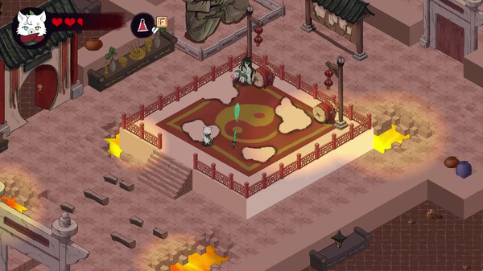

# Portfolio

# Project: Medicine Educational App with Unity

Before I went to University I did a two year course on video game development as a whole. This gave me the opportunity to do a 3 month long internship at Plymouth, ENgland. I worked at the University of Medicine and I worked on two projects simultaneously building an educational app using Unity and revising and fixing the code of a second VR project made on Unity as well. I cannot show any of the projects because the university is the owner of them and I sign an NDA about it but I am allowed to talk about them.

The first project was a gamified version of dental identification, the same thing used in TV shows to identify criminals and victims. In this game some robbers had escaped an explosion and only the teeth had been recovered. The player needed to discover who had escaped and who had died by inspecting the teeth. I worked closely with a 3D artist that took care of the models and animations as well as with the dentistry department that made suggestions on how to change the app. I built and integrated all the features myself and the app ended up being used in classes.

The second project was a VR game which needed to be updated and fixed. They wanted the game to work with Oculus as well as fix the errors and bugs that the game already had. In this project I took care of the bigger bugs and programming issues while the models and levels were integrated by an artist.

# Project: Re - Fense

**Flow Fields for AI and State Machines**

In my third year at Digipen my team aimed to make a Real-Time Strategy game against a great number of enemies. For this I made the State machine structure of the engine we built as a team and designed it so the swarm had a singular state machine controlling the whole group, iterating through each entity in the swarm and telling them what to do, this way we reduced the load that so many enemies would bring. I also Programmed the flow fields used to guide the enemies through the map. In the next video you'll see an example of them in action.

**A-star algorithm for Pathfinding**

In the same project I also programmed the A* algorithm used for the soldiers that the players would control. I had to do this with no prior knowledge of the algorithm since I didn't have any prior subject about the matter. This came with many challenges as there were barriers that could open and close (DOORS! O NO!). This meant that while any entity was moving they might need to recompute their path if a door had closed. This was solved by making the doors close slowly and compute the paths and flowfields in a separate thread while the game was running. Within a couple of frames the computation was done but this way we wouldn't have any surprise framerate drops in less powerful PCs.

# Project: Avani

https://store.steampowered.com/app/2103070/Avani/

**Producer**

In the second year at Digipen I worked on the game called Avani. This has been the biggest project I have worked on since we had to work with 5 other artists. I worked as a producer and as the communication link between the two teams since my previous course to university had already prepared me to understand the artists' needs and their vocabulary. Managing such a big team was no easy task but I am very proud of it. 

**Main Character Controller**

I built the main character controller in the early stages of development. Building the base for combat and movement that was later completed by other programmers. I also had to integrate the flying sword that would follow the player, its movement and attacks. In the later stages of development I worked with another programmer designing the attacking feeling that the main character had but couldn't program it myself because I was too busy building and fixing the levels.

**Enemy and Level Designer**

I designed all the levels of the game as well as all the enemies and tested and worked closely with the main programmer of the tool used to build the tile-based map. The isometric view and collisions were a headache to approach with this tile-based system but it ended up working. I also built the majority of the levels myself using that same tool from whiteboxing to end product.

